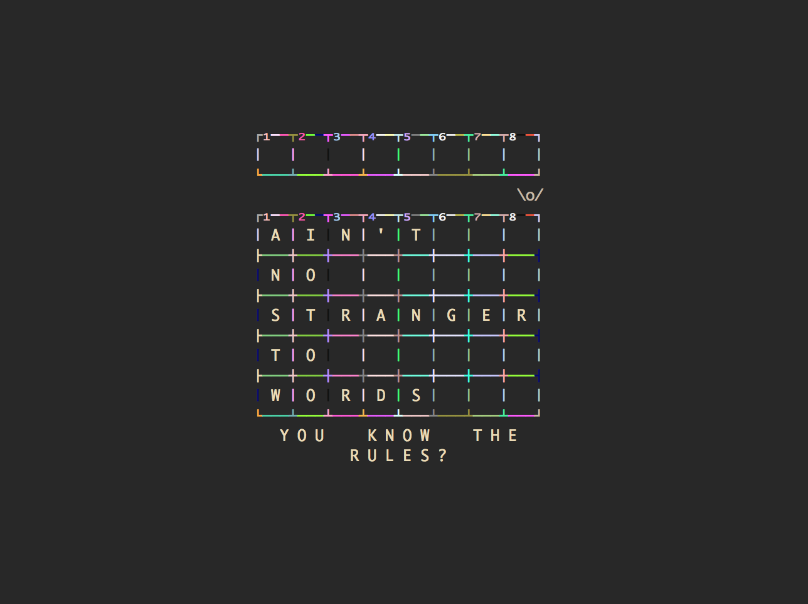
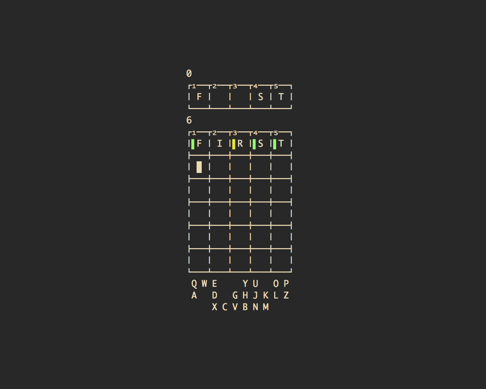
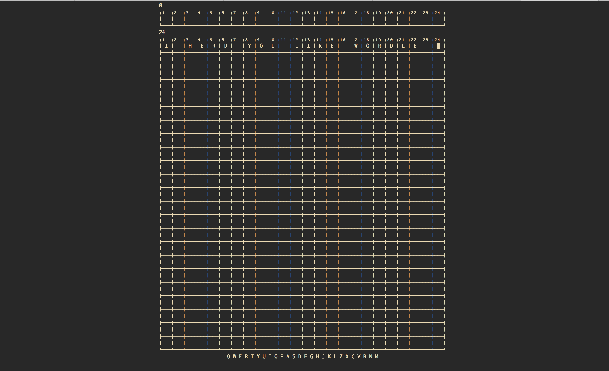

# wordshl
`wordshl` - an (attempted) TUI Wordle clone for bash

Inspiration:

https://www.powerlanguage.co.uk/wordle/

https://github.com/thisisparker/cursewords

# Keybindings

`ctrl-l` to move to the first column

`ctrl-r` to reveal the answer 

`tab` and `backspace` to navigate forward/backwards

`space` to blank the current column

# Usage

It looks for the `
wordle_answers.txt` and `
wordle_guesses.txt`  files in the current directory by default.

`--words` can be used to specify a single file for both answers and guesses. 

    wordshl: an (attempted) TUI Wordle clone for bash.
    ┌₁──┬₂──┬₃──┬₄──┬₅──┬₆──┬₇──┐
    | W | O | R | D | S | H | L |
    └───┴───┴───┴───┴───┴───┴───┘
    --strict      on|off  [default: on]
        Guesses must be a valid word from guess file

    --hard-mode   off|on  [default: off]
        Any revealed hints must be used in subsequent guesses

    --word-len            [default: 5]
        Length of word 

    --num-guesses         [default: 6] # $((RANDOM % 3 + 2))
        Number of guesses 

    --answer-file         [default: ./wordle_answers.txt]
        Path to wordlist of allowed answers

    --guess-file          [default: ./wordle_guesses.txt]
        Path to wordlist of allowed guesses

    --words          
        Path to wordlist of --answer-file/--guess-file

    --col N               [default: "center"]
        Display grid at Nth "column" on screen

    --row N               [default: "above-center"]
        Display grid at Nth "row" on screen

    --vt100
        Use vt100 box-drawing characters for grid

    --disco 
        You know the rules?
        
# Too easy?

How about some `--word-len 24`?

# Demo

https://user-images.githubusercontent.com/99486669/153619721-46eeafda-dec1-400f-809d-56d6335ceb5b.mp4

